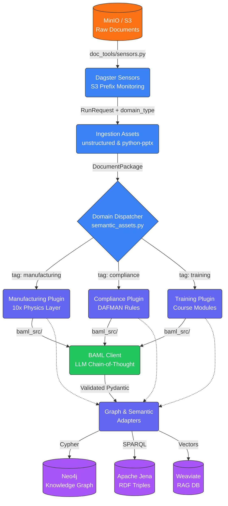

# Generative AI Document Ingestion Tools (`doc-tools`)

A domain-agnostic, configurable document data ingestion pipeline built with [Dagster](https://dagster.io). This repository provides a robust and reliable system for processing various document types (PDFs, presentations, words, etc.) and converting them into structured knowledge representations suitable for Generative AI applications like RAG (Retrieval-Augmented Generation).

## 🌊 Data Flow Architecture



## 🚀 Key Features

1. **Robust Document Parsing:** Extracts rich text, metadata, and embedded images from generic document formats using the high-resolution power of the `unstructured` library.
2. **Semantic Layout Detection:** Automatically identifies page layouts, reading orders, and structural semantic elements during processing via heuristic visual analysis.
3. **Graph Knowledge Representation:** Maps processed documents into a highly-linked **Neo4j** Knowledge Graph for traversing document relationships, concepts, and metadata.
4. **Vector Embeddings for RAG:** Embeds text chunks directly into **Weaviate** for immediate semantic search availability.
5. **Semantic Web Triples:** Emits standard OWL/RDF Triples representing structural schemas into **Apache Jena / Fuseki** via SPARQL.
6. **Configurability:** Fully configurable domains! Easily override GraphQL / Graph target labels and Vector DB collections via Dagster run configs.
7. **Event-Driven Ingestion:** Dynamic Dagster sensors monitor configurable S3 bucket/directory prefixes, instantaneously injecting `domain_type` routing tags (`manufacturing`, `compliance`) into the pipeline.
8. **10x Factory Extraction:** Maps deep-physics logic by rigorously isolating `is_value_added` from `is_safety_critical` steps into Neo4j for exact bottleneck and critical path analysis.

---

## 🏗️ Project Structure
- `baml_src/`: LLM prompt definitions mapped to structural schemas. Compiles via `baml-py` into Pydantic models natively in `doc_tools/baml_client`.
- `charts/doc-tools/`: The Helm Chart for deploying the application to Kubernetes, fully supporting ConfigMaps and Secrets.
- `doc_tools/`: The main Dagster application codebase.
  - `doc_tools/assets/ingestion_assets.py`: Core ingestion logic for unstructured/PPTX files.
  - `doc_tools/assets/semantic_assets.py`: Cypher logic for Neo4j Knowledge Graphs and generic Hybrid Graph synchronization (Jena/Neo4j).
  - `doc_tools/assets/xml_ingestion.py`: Universal XML extractor routing to specialized parsers (S1000D, DITA, IADS) based on MinIO directory prefixes.
  - `doc_tools/parsers/`: Specialized builders for MIL-spec standards including `s1000d_rdf.py`, `dita_rdf.py`, and `iads_rdf.py`.
  - `doc_tools/sensors.py`: Factory method for instantiating zero-downtime event-driven run requests based on mapped S3 directory prefixes.
  - `doc_tools/utils/`: Extracted domain implementations for text extraction, layout detection, Neo4j mapping, and Weaviate connections.
  - `doc_tools/definitions.py`: The entrypoint for Dagster orchestration that binds dependencies, resources, sensors, and configurations.
- `setup/`: Contains `setup_env.py` and local ontologies for priming the Neo4j, Weaviate, and Apache Jena databases before pipeline execution.
- `pyproject.toml`: The root Python project configuration and exact dependencies managed via [uv](https://docs.astral.sh/uv/).

---

## 🛠️ Setup Instructions

1. **Clone the repository:**
   ```bash
   git clone <your-repo-url>
   cd doc-tools
   ```

2. **Setup and Install via `uv`:**
   Use the ultrafast Python package manager `uv` to automatically wire the virtual environment and sync the specific subdependencies seamlessly.
   ```bash
   uv sync
   ```
   *(Note: You may need system-level tools like Tesseract-OCR and poppler installed depending on your OS for Unstructured logic to work out of the box).*

3. **Compile BAML Schemas:**
   If you modify the LLM prompts or schemas in `baml_src/`, you must recompile the Python clients.
   ```bash
   uv run baml-cli generate
   ```

---

## 💻 Development & Execution

To spin up the Dagster webserver, view the pipeline UI, or execute the underlying pipeline from your local desktop:

**Start Dagster Webserver:**
```bash
uv run dagster dev
```

### Running the Generalized Pipeline

The pipeline heavily employs `dagster.Config` via `IngestionConfig` to dynamically bind your document run to specific graph labels and vector databases index names to avoid domain lock-in. 

You can execute a pipeline run immediately using the local configuration via the Dagster Webserver by selecting `process_documents_job`.

Here is a look at what the sample execution YAML configuration (`doc_tools/example_run_config.yaml`) looks like for customizing domain labels:
```yaml
ops:
  build_knowledge_graph:
    config:
      source_directory: "/data/inputs"
      graph_node_label: "Course"
      graph_child_label: "Slide"
      vector_collection_name: "TrainingCourse"
```

To invoke that pipeline immediately from the CLI over a specific document dynamically:
```bash
uv run dagster job execute -m doc_tools.definitions -j process_documents_job -c doc_tools/example_run_config.yaml --tags '{"dagster/partition": "doc_id/file.pdf"}'
```

For the semantic XML pipeline, execute the `xml_graph_sync_job`. This job is optimized for K8s, passing RDF data in-memory between assets.

---

## 🧩 The Unified Military Graph (S1000D, DITA, IADS)

For aerospace and defense applications, technical manuals come in wildly different formats (S1000D, IADS, DITA). `doc-tools` solves this by acting as a **Semantic Translator**. 

Instead of dumping document-centric XML tags into a database, our parsers map all structural elements (Data Module Codes, Prerequisites, Tools, Hazards) into a single, unified **MIL Ontology**. 

**Why this matters:** Your AI Agents do not need to know how to read S1000D or IADS. They simply query the graph for `(Procedure)-[:requiresTool]->(Tool)`, and the graph effortlessly traverses across your entire fleet's documentation regardless of the original XML standard.

### The Hybrid "Reason-Then-Serve" Architecture

The system provides an end-to-end, Kubernetes-native orchestration pipeline (`xml_graph_sync_job`) for bridging deep semantic reasoning with high-speed property graphs:

```mermaid
graph LR
    %% Define Styles
    classDef storage fill:#f97316,stroke:#333,stroke-width:1px,color:#fff
    classDef memory fill:#0ea5e9,stroke:#333,stroke-width:1px,color:#fff
    classDef logic fill:#22c55e,stroke:#333,stroke-width:1px,color:#fff
    classDef sync fill:#6366f1,stroke:#333,stroke-width:1px,color:#fff
    classDef brain fill:#a855f7,stroke:#333,stroke-width:1px,color:#fff

    subgraph "Phase 1: In-Memory Ingestion"
        A[(MinIO / S3 <br> XML Tech Manuals)]:::storage -->|Stream Bytes| B(Directory Router <br> doc_tools.assets.xml_ingestion):::memory
        B -->|s1000d/| C1(S1000dGraphBuilder):::logic
        B -->|dita/| C2(DitaGraphBuilder):::logic
        B -->|iads/| C3(IadsGraphBuilder):::logic
    end

    subgraph "Phase 2: Semantic Unification"
        C1 --> D{MIL Ontology <br> mil#}:::brain
        C2 --> D
        C3 --> D
        D -->|Serialized RDF String| E(In-Memory Passing):::memory
    end

    subgraph "Phase 3: Deep Reasoning"
        E -->|HTTP POST| F[(Apache Jena <br> Fuseki Engine)]:::brain
        F -->|OWL/RDFS Reasoning| G(Graph Deduction <br> Inferred Triples):::brain
    end

    subgraph "Phase 4: High-Speed Sync"
        G -->|SPARQL CONSTRUCT| H(n10s Sync <br> doc_tools.assets.semantic_assets):::sync
        H -->|Cypher Import| I[(Neo4j <br> Production Graph)]:::sync
    end
```



1. **`extract_rdf_from_xml` (The Router):** A universal extractor that pulls XML files directly from MinIO into memory (Zero disk I/O). It reads the S3 directory prefix (e.g., `s1000d/` or `iads/`), dynamically routes the bytes to the correct parser, and passes the translated RDF Turtle string to the next asset in-memory.
2. **`upload_to_jena` (The Brain):** Pushes the raw RDF data to Apache Jena via HTTP. Jena applies our military ontologies and runs its semantic reasoner to deduce hidden logical connections (e.g., *Tool X requires Safety Goggles*).
3. **`init_neo4j_n10s` (The Config):** Idempotently prepares Neo4j's Neosemantics plugin to receive external RDF data.
4. **`sync_jena_to_neo4j` (The Muscle):** Uses a SPARQL `CONSTRUCT` query against Jena's `/query` endpoint to pull the **fully inferred knowledge graph** and sync it natively into Neo4j for millisecond AI Agent traversal.

### Event-Driven Ingestion Example

Because the pipeline is completely decoupled, adding new military manuals is as simple as dropping them into your object storage. The Dagster S3 sensor handles the rest.

```python
# The internal routing logic gracefully handles the heavy lifting in-memory:
doc_type = config.s3_key.split('/')[0].lower()

PARSERS = {
    's1000d': S1000dGraphBuilder,
    'iads': IadsGraphBuilder,
    'dita': DitaGraphBuilder
}

# Dynamically instantiate the correct parser
builder = PARSERS[doc_type]()

# Parse the in-memory bytes streamed directly from MinIO
builder.parse_data_module(xml_bytes)

# Return the unified RDF string directly to Dagster memory for the Jena upload
return builder.serialize(format="turtle")
```

---

## 🌩️ Deployment via Helm

A packaged Helm chart `/charts/doc-tools` is dynamically wired to receive credentials, mount configurations, and pull the latest GHCR Cloud Native Buildpack containers dynamically.

To configure and deploy to your cluster:
1. Copy or modify `charts/doc-tools/values.yaml` to specify your `secrets` (MinIO, Neo4j, Weaviate, and Jena credentials) and your Dagster run properties.
2. Template or deploy:
```bash
helm template doc-tools ./charts/doc-tools
# OR 
helm install doc-tools ./charts/doc-tools
```

**Note on First Deployment:** The Helm chart includes a `post-install` Job that automatically executes `setup/setup_env.py`. This securely primes your graph constraints, vector schemas, and downloads foundational Industrial Ontologies (IOF/ISA-95) into Apache Jena before the Dagster webserver even starts accepting traffic.
