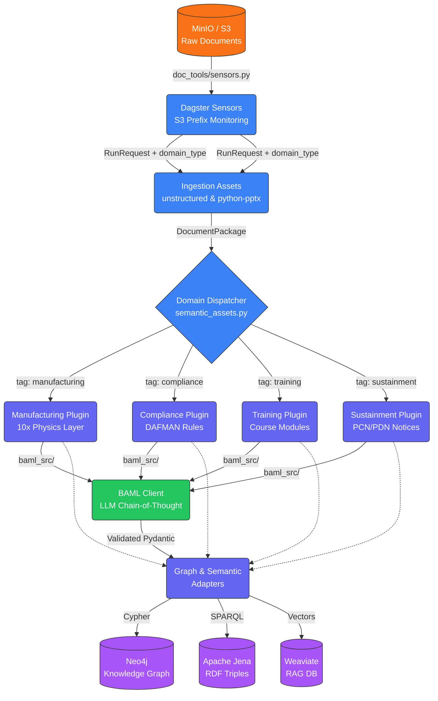
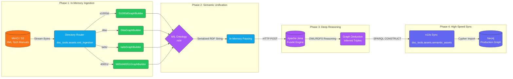

# Generative AI Document Ingestion Tools (`doc-tools`)

A domain-agnostic, configurable document data ingestion pipeline built with [Dagster](https://dagster.io). This repository provides a robust and reliable system for processing various document types (PDFs, presentations, words, etc.) and converting them into structured knowledge representations suitable for Generative AI applications like RAG (Retrieval-Augmented Generation).

## 🌊 Data Flow Architecture



## 🚀 Key Features

1. **Robust Document Parsing:** Extracts rich text, metadata, and embedded images from generic document formats using the high-resolution power of the `unstructured` library.
2. **Semantic Layout Detection:** Automatically identifies page layouts, reading orders, and structural semantic elements during processing via heuristic visual analysis.
3. **Graph Knowledge Representation:** Maps processed documents into a highly-linked **Neo4j** Knowledge Graph for traversing document relationships, concepts, and metadata.
4. **Vector Embeddings for RAG:** Embeds text chunks directly into **Weaviate** for immediate semantic search availability.
5. **Semantic Web Triples:** Emits standard OWL/RDF Triples representing structural schemas into **Apache Jena / Fuseki** via SPARQL.
6. **Semantic Binding Plane (Late Binding):** A universal linking layer that polls DataHub for `ontology_uri` tags, proposes standardized Phase 7 Glossary Terms, and synchronizes approved bindings to Neo4j.

---

## 🔒 Data Isolation & Domain Segregation

The pipeline implements a "Holy Trinity" of data segregation to ensure strict isolation between different business domains (e.g., `manufacturing`, `maintenance`, `compliance`, `sustainment`) sharing the same infrastructure.

### 1. Neo4j (Graph Knowledge)
Every node created by the pipeline carries a secondary label corresponding to its domain.
*   **Format**: `(:Label:DOMAIN_NAME)`
*   **Example**: `(:Procedure:MANUFACTURING)`, `(:Figure:MAINTENANCE)`
*   **Benefit**: Upstream consumers can perform `MATCH (n:Procedure:MANUFACTURING)` to guarantee zero cross-domain data leakage.
*   **Figure Nodes**: Steps that reference diagrams create `(:Figure:DOMAIN)` nodes linked via `[:REFERENCES_FIGURE]` relationships. XML-parsed tech manuals receive the `:MAINTENANCE` label via post-sync Cypher labeling after n10s import.

### 2. Weaviate (Vector Retrieval)
Every text chunk includes a `domain` metadata property.
*   **Usage**: Downstream RAG agents can apply a metadata filter: `filter={"path": ["domain"], "operator": "Equal", "valueText": "MANUFACTURING"}`.
*   **Benefit**: Ensures the LLM only "sees" context relevant to the specific domain during retrieval.
- **Imports**: Ensure all project imports use absolute paths relative to the project root (`doc_tools.xyz`). No relative imports going up the tree.
- **Semantic Binding Plane (Late Binding)**:
  - **Phase 7 URN Standard**: Always use `urn:li:glossaryTerm:{ShortName}` for ontology links. Store the full URI in `customProperties.ontology_uri`.
  - **DataHub Polling**: Do NOT parse local build artifacts (manifest.json). Consume semantic metadata via `doc_tools.assets.global_semantic_ingestion` by polling DataHub for tagged datasets.
  - **HITL Integration**: New semantic links must pass through `propose_datahub_term`. Neo4j synchronization (`sync_approved_tags_to_neo4j`) triggers only after HITL approval in DataHub.

### 3. Apache Jena (Deep Reasoning)
Strict isolation is maintained via **Named Graphs**:
*   **Documents**: Isolated in `urn:doc:{s3_key}`.
*   **Domain Ontologies**: Isolated in `http://internal/{domain}`.

### 🏷️ Domain Label Normalization
Input strings are automatically sanitized and normalized by the pipeline:
*   `manufacturing` -> `MANUFACTURING`
*   `maintenance-ops` -> `MAINTENANCE_OPS`
*   `Compliance 2024` -> `COMPLIANCE_2024`

---

6. **Configurability:** Fully configurable domains! Easily override GraphQL / Graph target labels and Vector DB collections via Dagster run configs.
7. **Event-Driven Ingestion:** Dynamic Dagster sensors monitor configurable S3 bucket/directory prefixes, instantaneously injecting `domain_type` routing tags (`manufacturing`, `compliance`, `sustainment`) into the pipeline.
8. **10x Factory Extraction:** Maps deep-physics logic by rigorously isolating `is_value_added` from `is_safety_critical` steps into Neo4j for exact bottleneck and critical path analysis.
9. **Sustainment Lifecycle Analysis:** Processes entire PCN/PDN documents in a single global context (with safe chunking for large files) to accurately aggregate impacted parts, replacements, and Last Time Buy (LTB) dates into the graph.
10. **Markdown Table Pre-processing:** Intercepts `unstructured` HTML tables and converts them to Markdown grids before LLM processing, ensuring high-fidelity extraction of complex tabular data.
11. **Prompt Management (CM-Canonical with an opt-in Langfuse path):** Decouples LLM instructions from BAML code. **Production runs from canonical, git-committed prompts** (`prompts/*.md`) baked into the image — what executes is exactly what was reviewed and merged via PR, with no runtime dependency on Langfuse. A `PROMPT_SOURCE=langfuse` escape hatch lets SMEs/devs hot-tune prompts live from the Langfuse GUI (with automatic file fallback), and a CI/CD drift check keeps the GUI and Git in sync. See [Prompt Source & GitOps](#-prompt-source--gitops-cm-canonical).
12. **Declarative Component Architecture:** Leverages `dag-tools` for a modular, reusable, and zero-config orchestration layer. Components like `S3SensorComponent` and `S3ToFileComponent` enable rapid fanning-out of pipelines across new domains.

---

## 🏗️ Project Structure
- `baml_src/`: LLM prompt definitions mapped to structural schemas. Compiles via `baml-py` into Pydantic models natively in `doc_tools/baml_client`.
- `prompts/`: Ground-truth Markdown files for LLM instructions. Synced with Langfuse via GitOps.
- `charts/doc-tools/`: The Helm Chart for deploying the application to Kubernetes, fully supporting ConfigMaps and Secrets.
- `doc_tools/`: The main Dagster application codebase.
  - `doc_tools/assets/ingestion_assets.py`: Core ingestion logic for unstructured/PPTX files.
  - `doc_tools/assets/semantic_assets.py`: Cypher logic for Neo4j Knowledge Graphs and generic Hybrid Graph- `doc_tools/assets/dds_ingestion.py` & `doc_tools/assets/rabbitmq_ingestion.py`: Git-native schema ingestion assets that dynamically clone OMG DDS `.idl` and RabbitMQ `.json` schema repositories into ephemeral temp directories, parse them using AST/recursive strategies, and emit them to DataHub to build end-to-end lineage graphs across the Redpanda/Kafka execution engine.
- `doc_tools/assets/global_semantic_ingestion.py`: The central authority for the **Semantic Binding Plane**. It implements a "Late Binding" architecture by polling DataHub for any dataset (dbt, legacy, etc.) tagged with an `ontology_uri` custom property and proposing standardized Phase 7 Glossary Terms.
- `doc_tools/assets/semantic_linker.py`: Standardized workflow for proposing and syncing semantic links. Refined for Phase 7 URNs (`urn:li:glossaryTerm:ShortName`) and dynamic URI resolution via DataHub GMS.
- `doc_tools/parsers/`: Specialized builders for MIL-spec standards (`s1000d_rdf.py`, `dita_rdf.py`, `iads_rdf.py`, `mil_std_40051_rdf.py`). All parsers extract `mil:Figure` triples from format-specific tags (`<figure>`, `<graphic boardno>`, `<graphic infoEntityIdent>`, `<fig>`, `<image>`).
mentations for text extraction, layout detection, Neo4j mapping, and Weaviate connections.
    - `doc_tools/utils/formatters.py`: Utilities for converting HTML elements (tables) to Markdown.
  - `doc_tools/definitions.py`: The entrypoint for Dagster orchestration.
- `scripts/`:
  - `check_drift.py`: CI/CD script to validate prompt sync between Git and Langfuse.
- `setup/`: Empty. Historical home of `setup_env.py` (the substrate-priming script, retired 2026-06-17) and the custom TBox extension TTLs. Both moved out: priming is now owned by `invincible-agent/setup/prime_databases.py` (invoked via the invincible-agent chart's `primeSubstrate` Helm Job), and the TBox extensions (`mro_extension`, `maintenance_extension`, `mil_extension`, `idp_extension`, `mesh_system`) are vendored directly into `invincible-agent/setup/ontologies/` — eliminating the prior cross-repo URL coupling. doc-tools no longer hosts ontology source. Plugin code (e.g., `doc_tools/parsers/mil_40051_ingest.py`, `doc_tools/parsers/s1000d_ingest.py`) continues to reference class URIs as strings; the URIs are unchanged, only the file location is different.
- `pyproject.toml`: The root Python project configuration managed via [uv](https://docs.astral.sh/uv/).

---

## 🛠️ Setup Instructions

1. **Clone the repository:**
   ```bash
   git clone <your-repo-url>
   cd doc-tools
   ```

2. **Setup and Install via `uv`:**
   Use the ultrafast Python package manager `uv` to automatically wire the virtual environment and sync the specific subdependencies seamlessly.
   ```bash
   uv sync
   ```
   *(Note: You may need system-level tools like Tesseract-OCR and poppler installed depending on your OS for Unstructured logic to work out of the box).*

3. **Compile BAML Schemas:**
   If you modify the LLM prompts or schemas in `baml_src/`, you must recompile the Python clients.
   ```bash
   uv run baml-cli generate
   ```

---

## 💻 Development & Execution

To spin up the Dagster webserver, view the pipeline UI, or execute the underlying pipeline from your local desktop:

**Start Dagster Webserver:**
```bash
uv run dagster dev
```

### Running the Generalized Pipeline

The pipeline heavily employs `dagster.Config` via `IngestionConfig` to dynamically bind your document run to specific graph labels and vector databases index names to avoid domain lock-in. 

You can execute a pipeline run immediately using the local configuration via the Dagster Webserver by selecting `process_documents_job`.

Here is a look at what the sample execution YAML configuration (`doc_tools/example_run_config.yaml`) looks like for customizing domain labels:
```yaml
ops:
  build_knowledge_graph:
    config:
      source_directory: "/data/inputs"
      graph_node_label: "Course"
      graph_child_label: "Slide"
      vector_collection_name: "TrainingCourse"
```

To invoke that pipeline immediately from the CLI over a specific document dynamically:
```bash
uv run dagster job execute -m doc_tools.definitions -j process_documents_job -c doc_tools/example_run_config.yaml --tags '{"dagster/partition": "doc_id/file.pdf"}'
```

For the semantic XML pipeline, execute the `xml_graph_sync_job`. This job is optimized for K8s, passing RDF data in-memory between assets.

---

### 🧩 Component-Based Orchestration (`dag-tools`)

The core of `doc-tools` now utilizes a **Declarative Component Architecture** powered by the `dag-tools` library. This shift allows for more modular, testable, and reusable pipeline definitions.

#### Key Components:
1.  **`S3ToFileComponent`**: A high-level component that abstracts the ingestion of documents from S3. It manages the underlying assets, jobs, and configurations (e.g., graph labels, vector collections) in a single, typed object.
2.  **`S3SensorComponent`**: A decoupled sensor component that monitors S3 buckets/prefixes and automatically triggers the appropriate ingestion jobs when new files are detected.

This architecture eliminates the need for external `config.yaml` files, moving all metadata-driven logic into the `definitions.py` file where it can be version-controlled and validated natively by Python.

---

## 🧩 The Unified Military Graph (S1000D, DITA, IADS, 40051)

For aerospace and defense applications, technical manuals come in wildly different formats (S1000D, IADS, DITA, and the US Army MIL-STD-40051). `doc-tools` solves this by acting as a **Semantic Translator**. 

Instead of dumping document-centric XML tags into a database, our parsers map all structural elements (Data Module Codes, Prerequisites, Tools, Hazards) into a single, unified **MIL Ontology**. 

**Why this matters:** Your AI Agents do not need to know how to read S1000D, IADS, or Army Work Packages. They simply query the graph for `(Procedure)-[:requiresTool]->(Tool)`, and the graph effortlessly traverses across your entire fleet's documentation regardless of the original XML standard.

### The Hybrid "Reason-Then-Serve" Architecture

The system provides an end-to-end, Kubernetes-native orchestration pipeline (`xml_graph_sync_job`) for bridging deep semantic reasoning with high-speed property graphs:



1. **`extract_rdf_from_xml` (The Router):** A universal extractor that pulls XML files directly from MinIO into memory (Zero disk I/O). It reads the S3 directory prefix (e.g., `s1000d/`, `iads/`, or `40051/`), dynamically routes the bytes to the correct parser, and passes the translated RDF Turtle string to the next asset in-memory.
2.- **Hybrid Graph Synchronization & Revisioning**:
  1. **Named Graphs**: Every document MUST be isolated in its own Jena Named Graph using its identifier (e.g., `urn:doc:{s3_key}`).
  2. **Jena PUT First**: Use `httpx.put` to push Turtle data to the Named Graph. This ensures the old revision is completely replaced in the reasoning engine.
  3. **Neo4j Wipe**: Before importing the new revision, execute `MATCH (n:Resource {uri: $uri}) DETACH DELETE n` on the root node URI to clear the old graph structure.
  4. **Targeted Fetch**: Use a SPARQL `CONSTRUCT` query restricted to the document's `GRAPH <uri>` to fetch and sync only the latest version through `n10s`.
  5. **Post-Sync Domain Labeling**: After n10s import, apply `:MAINTENANCE` label to all imported Resource nodes via `_apply_post_sync_domain_labels()`. This ensures XML tech manuals are visible to downstream agents that filter by Neo4j domain labels.
  6. **In-Memory Triples**: Pass raw Turtle data and root URIs between assets as dictionaries; do not use the local filesystem.

- **Semantic Binding Plane (Late Binding & URN Standardization)**:
  1. **Phase 7 URN Standard**: Glossary Term URNs MUST use the Short Name (e.g., `urn:li:glossaryTerm:MaintenanceWorkOrder`).
  2. **URI Storage**: The full Ontology URI MUST be stored in the `customProperties` aspect of the `GlossaryTerm` entity under the key `ontology_uri`.
  3. **DataHub Polling (Late Binding)**: Do NOT parse local dbt or metadata files for semantic tags. Use `doc_tools.assets.global_semantic_ingestion` to poll DataHub GMS for any `Dataset` possessing the `ontology_uri` custom property.
  4. **HITL Workflow**: All semantic linkings must go through the `propose_datahub_term` flow for human-in-the-loop approval before being synced to the Neo4j Knowledge Graph via the `datahub_approval_sensor`.
  5. **Neo4j Sync**: The `sync_approved_tags_to_neo4j` asset must fetch the full `ontology_uri` from the DataHub entity's `customProperties` at runtime to ensure graph accuracy.
r S3 sensor handles the rest.

```python
# The internal routing logic gracefully handles the heavy lifting in-memory:
doc_type = config.s3_key.split('/')[0].lower()

PARSERS = {
    's1000d': S1000dGraphBuilder,
    'iads': IadsGraphBuilder,
    'dita': DitaGraphBuilder,
    '40051': MilStd40051GraphBuilder
}

# Dynamically instantiate the correct parser
builder = PARSERS[doc_type]()

# Parse the in-memory bytes streamed directly from MinIO
builder.parse_data_module(xml_bytes)

# Return the unified RDF string directly to Dagster memory for the Jena upload
return builder.serialize(format="turtle")
```

---

## 📡 DataHub Schema Ingestion & Lineage (DDS & RabbitMQ)

`doc-tools` acts as the metadata bridge for your edge-to-enterprise architecture, ensuring that AI Agents can programmatically traverse your data plane from edge sensors to enterprise message brokers.

We support ingesting both **OMG DDS (.idl)** and **RabbitMQ JSON Schema (.json)** files directly into DataHub, while automatically drawing the lineage graph across your Redpanda/Kafka execution engine.

### The Lineage Graph
By ingesting these schemas, DataHub builds the complete end-to-end story:
`dds:RotorTelemetry` (Rich IDL Metadata) ➔ `kafka:openddil.sensor.data` (Redpanda Backbone) ➔ `rabbitmq:rotor_status` (Rich JSON Schema Metadata)

### 1. DDS IDL Ingestion
- **Parser**: A robust AST parser (`idl-parser`) traverses nested IDL modules and complex sequence types, extracting rich block and inline comments.
- **Asset**: `ingest_dds_idl_schemas`
- **Lineage**: Emits an `UpstreamLineage` edge from the DDS schema to the configured raw Kafka topic.

### 2. RabbitMQ JSON Schema Ingestion
- **Parser**: A recursive JSON Schema parser that flattens deeply nested properties and arrays into dot-notation (e.g., `telemetry.rotors[].rpm`) and extracts descriptions and enums.
- **Asset**: `ingest_rabbitmq_schemas`
- **Lineage**: Emits an `UpstreamLineage` edge from the raw Kafka topic to the RabbitMQ schema.

### 🗂️ Git-Native Schema Ingestion
Unlike the event-driven PDF and XML pipelines which use `S3SensorComponent` to stream bytes directly from MinIO into memory, the schema parsers are designed for ephemeral Kubernetes pods and dynamically clone Git repositories at runtime.

To configure the ingestion assets (`ingest_dds_idl_schemas` and `ingest_rabbitmq_schemas`), you must provide the following parameters in your Dagster Run Config:
- `git_repo_url`: The HTTPS URL of the Git repository containing your schemas.
- `git_branch`: The branch to clone (defaults to `"main"`).
- `git_token`: (Optional) A Personal Access Token (PAT) for private repositories. The asset securely injects this into the HTTPS URL (`https://<token>@github.com/...`).
- `schema_path_in_repo`: The relative path inside the repository where the schemas are located (defaults to `"schemas/dds"` or `"schemas/rabbitmq"`).

The assets use Python's `tempfile.TemporaryDirectory()` and `subprocess` to clone the repository, parse the schemas, and then automatically wipe the cloned repository from the pod's disk upon completion, guaranteeing no state bleed between runs.

---

## 🗄️ Legacy Schema & Design Metadata Extraction (Oracle, SQL Server, .NET EDMX, JSON)

Beyond unstructured documents, `doc-tools` can pull structured metadata directly from **legacy databases and data-modelling tool exports**, then route it through the same **Semantic Binding Plane** so that existing tables get classified against the enterprise ontology and surfaced in the Neo4j Knowledge Graph.

Each source is a **Declarative Component** wired in [`doc_tools/definitions.py`](doc_tools/definitions.py). Every extractor emits a uniform, domain-tagged mapping so they can be merged transparently downstream:

```python
{ "schema.table_name": { "description": "<DBA / model comment>", "domain": "<DOMAIN_TAG>" } }
```

### Supported Sources

| Source | Component | Asset | What it reads |
| :--- | :--- | :--- | :--- |
| **Oracle** (live) | `OracleExtractorComponent` (`components/oracle_extractor.py`) | `extract_oracle_metadata` | Table comments from `ALL_TAB_COMMENTS` via `oracledb`. Connects with `ORACLE_HOST` / `ORACLE_PORT` / `ORACLE_SERVICE_NAME` / `ORACLE_USERNAME` / `ORACLE_PASSWORD`. |
| **SQL Server** (live) | `SqlServerExtractorComponent` (`components/sqlserver_extractor.py`) | `extract_sqlserver_metadata` | `MS_Description` extended properties from `sys.extended_properties` via SQLAlchemy + `pyodbc` (ODBC Driver 18). |
| **.NET Entity Framework** (file) | `DesignParserComponent` (`components/design_parser.py`) | `parse_design_metadata` | `.edmx` XML exports — extracts `EntityType` names, `NavigationProperty` relationships, and `Documentation/Summary` descriptions from the ADO conceptual model. |
| **JSON modelling-tool export** (file) | `DesignParserComponent` (`components/design_parser.py`) | `parse_design_metadata` | `.json` toolchain exports — reads `tables[]` with `name`, `description`, and `relations`. |

> The two **live database** extractors (Oracle, SQL Server) open a connection at run time and are configured via environment variables in `definitions.py`. The two **file-based** formats (`.edmx`, `.json`) are handled by a single `DesignParserComponent`, which is fed by an S3 sensor (`design_sensor`) watching the `DESIGN_BUCKET` (default `design-artifacts`) and triggering the partitioned `parse_design_metadata_job`.

### The Classify-Then-Bind Flow

All four outputs converge in `apply_semantic_tags` ([`doc_tools/assets/semantic_linker.py`](doc_tools/assets/semantic_linker.py)), which:

1. **Merges** the three asset outputs (`extract_sqlserver_metadata`, `extract_oracle_metadata`, `parse_design_metadata`) into one map.
2. **Classifies** each table by POSTing a "dossier" (table name, columns, DBA comments, ORM class, domain) to the Ontology Service's `/classify_legacy_table` endpoint.
3. **Auto-tags** any table whose classification confidence is `>= 0.85`, proposing a standardized Phase 7 Glossary Term (`urn:li:glossaryTerm:{ShortName}`) into DataHub via `propose_datahub_term`. Lower-confidence matches are routed to human review.
4. From there the standard **Semantic Binding Plane** takes over — HITL approval in DataHub, then sync to Neo4j via `sync_approved_tags_to_neo4j`.

> **Domain tagging**: Every extractor injects a `domain` tag (default `DATA_ENGINEERING`) into each record. For the file-based parser the domain is inferred from the S3 key prefix (`domain/design_files/file.edmx`), preserving the same strict domain-segregation guarantees as the document pipeline.

---

## 📝 Prompt Source & GitOps (CM-Canonical)

LLM instructions are decoupled from BAML code and stored as ground-truth Markdown in `prompts/*.md`. How the running pipeline **sources** a prompt is governed by two environment variables, with safe, reproducible defaults:

| Variable | Default | Effect |
| :--- | :--- | :--- |
| `PROMPT_SOURCE` | `file` | `file` = load the canonical, git-committed prompt (production default — no Langfuse on the hot path). `langfuse` = fetch live from the Langfuse GUI, falling back to the file if Langfuse is unreachable. |
| `LANGFUSE_PROMPT_LABEL` | `production` | The Langfuse label served on the `langfuse` path **and** validated by the CI drift check — a single knob so CI guards exactly what the live path can serve. |

### Why `file` is the production default
For a safety-/compliance-critical pipeline, a given container image must produce **deterministic, auditable** extraction. Sourcing prompts live from a GUI would let the *same image* yield different safety-critical results depending on what someone edited in Langfuse minutes ago. So:

- **Production (engineers-via-PR, the canonical path):** leave `PROMPT_SOURCE` unset (`file`). Prompt changes flow through PR review → CI → image build → deploy. Langfuse is never contacted at runtime.
- **Dev / SME hot-tuning (the opt-in path):** set `PROMPT_SOURCE=langfuse`. SMEs iterate in the Langfuse GUI without a redeploy. This path is for experimentation — it is **not** canonical.

### The promotion loop (closing the GUI → Git gap)
1. SME edits and labels a prompt in the Langfuse GUI (dev runs with `PROMPT_SOURCE=langfuse`).
2. The change is reconciled back into `prompts/*.md` via a PR.
3. `scripts/check_drift.py` runs in CI and **fails the merge** if any local file diverges from the `LANGFUSE_PROMPT_LABEL` version in Langfuse — forcing the GUI change to be committed before it can ship.
4. Merge → image build (prompts baked in) → deploy. Production now serves the reviewed, canonical text.

> **Resilience:** Even on the `langfuse` path, an unreachable Langfuse degrades gracefully to the canonical file rather than failing the run (see `doc_tools/plugins/base.py::_get_dynamic_prompt`).

---

## 🧩 Proprietary / Overlay Extraction Fields (Manufacturing)

The manufacturing work-instruction extractor splits its schema into a **base** (committed, public: identity, instruction text, action, tooling, figures) and a data-driven **overlay** ([`doc_tools/plugins/manufacturing_overlay.py`](doc_tools/plugins/manufacturing_overlay.py)). Each overlay field declares **both** how it is extracted (a BAML description) **and** how it is persisted (Neo4j attribute, typed relationship, and/or RDF triple) — so a new field never requires editing the graph writer or the BAML class.

Two overlays compose at runtime:
- **Default overlay** — the non-proprietary hooks/analytics, committed in the module.
- **Proprietary overlay** — loaded from a secret JSON file pointed at by `MANUFACTURING_OVERLAY_SPEC`. Field names/descriptions **never enter this repo**: they are injected onto the `@@dynamic` `ManufacturingStep` via BAML `TypeBuilder`, extracted by the LLM, carried through the plugin, and persisted by the same descriptor machinery. When the env var is unset, extraction and persistence are exactly as before.

### Spec format
A reference (non-proprietary) spec lives at [`examples/manufacturing_overlay.sample.json`](examples/manufacturing_overlay.sample.json). Each entry under `fields`:

| key | meaning |
| :--- | :--- |
| `name` | the field name on the step |
| `kind` | `scalar` / `list` / `int` / `bool` / `enum` |
| `description` | extraction instruction shown to the LLM (in `{{ ctx.output_format }}`) |
| `optional` | default `true` |
| `neo4j_attr` | `SET s.<name>` on the `ManufacturingStep` node |
| `related` | `{ label, rel_type, id_prefix, value_prop }` → a typed node + edge off the step |
| `rdf_literal` | predicate for an RDF literal triple (`mfg:<step> mfg:<pred> "value"`) |
| `rdf_relation` | `{ predicate, target_prefix, target_suffix }` → RDF object-property to a derived IRI |

A field may combine kinds (e.g. `neo4j_attr` + `rdf_literal`, or a `related` relationship).

### Enabling in Kubernetes
**Recommended** (proprietary content stays out of git *and* Helm release history) — reference a pre-created secret:
```bash
kubectl create secret generic mfg-overlay \
  --from-file=manufacturing_overlay.json=./my_overlay.json
helm upgrade doc-tools ./charts/doc-tools \
  --set manufacturingOverlay.enabled=true \
  --set manufacturingOverlay.existingSecret=mfg-overlay
```
The JSON is mounted read-only at `manufacturingOverlay.mountPath` and `MANUFACTURING_OVERLAY_SPEC` is set automatically. For local/dev only, `manufacturingOverlay.spec` accepts inline JSON (the chart then creates the secret for you).

> **Scope note:** the overlay carries proprietary *fields*. Proprietary *prompt text* (the `system_instructions`) is governed separately by [Prompt Source & GitOps](#-prompt-source--gitops-cm-canonical) — keep it in Langfuse (dev) or a secret-mounted md, not the committed prompt.

---

## ⚙️ Performance Tuning & K8s Resource Control

The pipeline supports dynamic Kubernetes resource allocation via environment variables. This allows DevOps to scale high-compute assets (like PDF parsing) independently from metadata-light tasks.

Every job prefix supports four variables: `_CPU_REQUEST`, `_MEM_REQUEST`, `_CPU_LIMIT`, and `_MEM_LIMIT`.

| Job Prefix | Default (CPU/Mem) | Purpose |
| :--- | :--- | :--- |
| `DOC_PARSER` | 2000m / 6Gi | Core Unstructured PDF/PPTX extraction (LLM-heavy) |
| `XML_INGEST` | 2000m / 6Gi | Universal XML Routing & RDF Extraction |
| `METADATA_INGEST`| 1000m / 2Gi | DDS IDL and RabbitMQ JSON Schema ingestion |
| `ONTOLOGY_INGEST`| 1000m / 2Gi | Jena/Fuseki ontology syncing |
| `DESIGN_PARSER` | 1000m / 2Gi | CAD/Technical design metadata parsing |

**Example usage in K8s manifest:**
```yaml
env:
  - name: DOC_PARSER_CPU_REQUEST
    value: "4000m"
  - name: DOC_PARSER_MEM_REQUEST
    value: "12Gi"
```

---

## 🌩️ Deployment via Helm

A packaged Helm chart `/charts/doc-tools` is dynamically wired to receive credentials, mount configurations, and pull the latest GHCR Cloud Native Buildpack containers dynamically.

To configure and deploy to your cluster:
1. Copy or modify `charts/doc-tools/values.yaml` to specify your `secrets` (MinIO, Neo4j, Weaviate, and Jena credentials) and your Dagster run properties.
2. Template or deploy:
```bash
helm template doc-tools ./charts/doc-tools
# OR 
helm install doc-tools ./charts/doc-tools
```

**Note on First Deployment (substrate priming):** The doc-tools chart no longer includes a substrate-priming Job. Substrate priming was unified into the `invincible-agent` chart on 2026-06-17 — it ships a `primeSubstrate` post-install/post-upgrade Helm Job that runs `invincible-agent/setup/prime_databases.py` (the modernized successor to the deprecated `setup_env.py`). The new mechanism uses explicit semantic domains (`MAINTENANCE`, `MANUFACTURING`, `SUSTAINMENT`, `DATA_ENGINEERING`, `MESH`) instead of path-derived ones, provisions the Jena dataset, and supports a triple-guarded `--wipe` flag for fresh-start re-primes. See `invincible-agent/tests/routing/SESSION_3_DEPLOY_CHECKLIST.md §2.1` for the deploy procedure.
