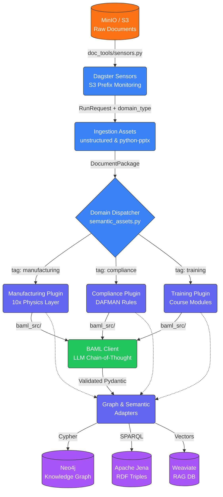

# Generative AI Document Ingestion Tools (`doc-tools`)

A domain-agnostic, configurable document data ingestion pipeline built with [Dagster](https://dagster.io). This repository provides a robust and reliable system for processing various document types (PDFs, presentations, words, etc.) and converting them into structured knowledge representations suitable for Generative AI applications like RAG (Retrieval-Augmented Generation).

## 🌊 Data Flow Architecture



## 🚀 Key Features

1. **Robust Document Parsing:** Extracts rich text, metadata, and embedded images from generic document formats using the high-resolution power of the `unstructured` library.
2. **Semantic Layout Detection:** Automatically identifies page layouts, reading orders, and structural semantic elements during processing via heuristic visual analysis.
3. **Graph Knowledge Representation:** Maps processed documents into a highly-linked **Neo4j** Knowledge Graph for traversing document relationships, concepts, and metadata.
4. **Vector Embeddings for RAG:** Embeds text chunks directly into **Weaviate** for immediate semantic search availability.
5. **Semantic Web Triples:** Emits standard OWL/RDF Triples representing structural schemas into **Apache Jena / Fuseki** via SPARQL.
6. **Configurability:** Fully configurable domains! Easily override GraphQL / Graph target labels and Vector DB collections via Dagster run configs.
7. **Event-Driven Ingestion:** Dynamic Dagster sensors monitor configurable S3 bucket/directory prefixes, instantaneously injecting `domain_type` routing tags (`manufacturing`, `compliance`) into the pipeline.
8. **10x Factory Extraction:** Maps deep-physics logic by rigorously isolating `is_value_added` from `is_safety_critical` steps into Neo4j for exact bottleneck and critical path analysis.

---

## 🏗️ Project Structure
- `baml_src/`: LLM prompt definitions mapped to structural schemas. Compiles via `baml-py` into Pydantic models natively in `doc_tools/baml_client`.
- `charts/doc-tools/`: The Helm Chart for deploying the application to Kubernetes, fully supporting ConfigMaps and Secrets.
- `doc_tools/`: The main Dagster application codebase.
  - `doc_tools/assets/`: The Dagster data assets forming the core ingestion and semantic pipelines. Includes the `hybrid_graph_assets.py` for Jena/Neo4j synchronization.
  - `doc_tools/plugins/`: Contains the **Domain-Agnostic Plugin Architecture**. Base structural nodes are passed here where domain logic (Training, Manufacturing/MAT, Compliance) invokes BAML schemas and returns Cypher/SPARQL queries.
  - `doc_tools/parsers/`: Specialized parsers for structured standards, featuring the `s1000d_rdf.py` graph builder.
  - `doc_tools/sensors.py`: Factory method for instantiating zero-downtime event-driven run requests based on mapped S3 directory prefixes.
  - `doc_tools/utils/`: Extracted domain implementations for text extraction, layout detection, Neo4j mapping, and Weaviate connections.
  - `doc_tools/definitions.py`: The entrypoint for Dagster orchestration that binds dependencies, resources, sensors, and configurations.
- `setup/`: Contains `setup_env.py` and local ontologies for priming the Neo4j, Weaviate, and Apache Jena databases before pipeline execution.
- `pyproject.toml`: The root Python project configuration and exact dependencies managed via [uv](https://docs.astral.sh/uv/).

---

## 🛠️ Setup Instructions

1. **Clone the repository:**
   ```bash
   git clone <your-repo-url>
   cd doc-tools
   ```

2. **Setup and Install via `uv`:**
   Use the ultrafast Python package manager `uv` to automatically wire the virtual environment and sync the specific subdependencies seamlessly.
   ```bash
   uv sync
   ```
   *(Note: You may need system-level tools like Tesseract-OCR and poppler installed depending on your OS for Unstructured logic to work out of the box).*

3. **Compile BAML Schemas:**
   If you modify the LLM prompts or schemas in `baml_src/`, you must recompile the Python clients.
   ```bash
   uv run baml-cli generate
   ```

---

## 💻 Development & Execution

To spin up the Dagster webserver, view the pipeline UI, or execute the underlying pipeline from your local desktop:

**Start Dagster Webserver:**
```bash
uv run dagster dev
```

### Running the Generalized Pipeline

The pipeline heavily employs `dagster.Config` via `IngestionConfig` to dynamically bind your document run to specific graph labels and vector databases index names to avoid domain lock-in. 

You can execute a pipeline run immediately using the local configuration via the Dagster Webserver by selecting `process_documents_job`.

Here is a look at what the sample execution YAML configuration (`doc_tools/example_run_config.yaml`) looks like for customizing domain labels:
```yaml
ops:
  build_knowledge_graph:
    config:
      source_directory: "/data/inputs"
      graph_node_label: "Course"
      graph_child_label: "Slide"
      vector_collection_name: "TrainingCourse"
```

To invoke that pipeline immediately from the CLI over a specific document dynamically:
```bash
uv run dagster job execute -m doc_tools.definitions -j process_documents_job -c doc_tools/example_run_config.yaml --tags '{"dagster/partition": "doc_id/file.pdf"}'
```

---

## 🧩 S1000D Semantic Parsing (Experimental)

For aerospace and defense applications handling S1000D XML Data Modules, `doc-tools` provides a formal RDF builder to map complex documents to industrial ontologies.

### Dagster Integration Example

Lower-level engineers can integrate the `S1000dGraphBuilder` inside a modular Dagster `@asset` to build unified RDF graphs:

```python
from dagster import asset, Output
from doc_tools.parsers.s1000d_rdf import S1000dGraphBuilder
import os

@asset
def s1000d_knowledge_graph_asset():
    builder = S1000dGraphBuilder()
    xml_dir = "data/s1000d_modules"
    
    for filename in os.listdir(xml_dir):
        if filename.endswith(".xml"):
            path = os.path.join(xml_dir, filename)
            with open(path, "rb") as f:
                dmc_uri = builder.parse_data_module(f.read())
                print(f"Ingested DM: {dmc_uri}")
    
    # Serialize to Turtle for Graph DB ingestion
    rdf_data = builder.serialize(format="turtle")
    with open("output/unified_s1000d.ttl", "w") as f:
        f.write(rdf_data)
        
    return Output(value=rdf_data, metadata={"triples": len(builder.graph)})

### Hybrid Graph Synchronization

The `hybrid_graph_assets` module provides an end-to-end orchestration for bridging semantic reasoning with property graphs:

1. **`upload_to_jena`**: Pushes the generated `.ttl` to the Jena Fuseki endpoint via `httpx`.
2. **`init_neo4j_n10s`**: Idempotently prepares Neo4j for RDF ingestion.
3. **`sync_jena_to_neo4j`**: Uses a SPARQL `CONSTRUCT` query against the Jena `/query` endpoint to pull the **fully inferred knowledge graph** (including logical deductions) and syncs it into Neo4j using Neosemantics (n10s).
```

---

## 🌩️ Deployment via Helm

A packaged Helm chart `/charts/doc-tools` is dynamically wired to receive credentials, mount configurations, and pull the latest GHCR Cloud Native Buildpack containers dynamically.

To configure and deploy to your cluster:
1. Copy or modify `charts/doc-tools/values.yaml` to specify your `secrets` (MinIO, Neo4j, Weaviate, and Jena credentials) and your Dagster run properties.
2. Template or deploy:
```bash
helm template doc-tools ./charts/doc-tools
# OR 
helm install doc-tools ./charts/doc-tools
```

**Note on First Deployment:** The Helm chart includes a `post-install` Job that automatically executes `setup/setup_env.py`. This securely primes your graph constraints, vector schemas, and downloads foundational Industrial Ontologies (IOF/ISA-95) into Apache Jena before the Dagster webserver even starts accepting traffic.
